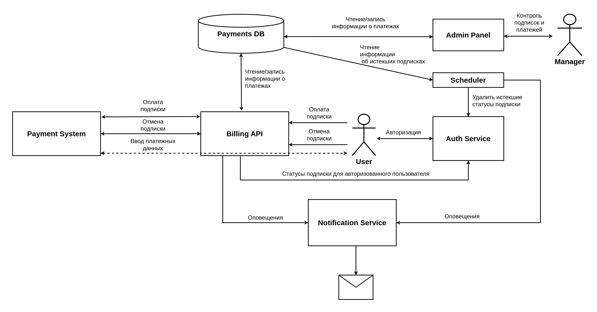

# Дипломная работа: Биллинг

[](https://github.com/aigt/graduate_work/actions/workflows/main.yml)  
Сервис для оплаты подписок в онлайн-кинотеатре.

## Содержание

- [Описание проекта](#Описание)
- [Состав репозитория](#Состав)
- [Технологии](#Технологии)
- [Запуск сервиса](#Запуск)
- [Архитектура сервиса](#Архиектура)
- [Репозитории сервисов инфраструктуры онлайн-кинотеатра](#Репозитории)
- [Ссылка на текущий репозиторий](#Ссылка)


## <a name="Описание">Описание проекта</a>
Сервис представляет собой платежную систему, при помощи которой пользователи могут оплачивать кредитными картами подписку в онлайн-кинотеатре. Дополнительно сервис дает возможность пользователям отказаться от подписки в любой удобный для них момент. Также в проекте присутствует панель администратора, через которую персонал может наблюдать за активностью пользователей, их подписками, и на основе этих данных проводить аналитику.  
### Документация

Сервис реализован в соответствии с разработанным проектным заданием:

- [documentation/Statement.md](documentation/Statement.md) проектное задание
## <a name="Состав">Состав репозитория</a>

- [Administarton Panel](admin_panel) - Панель для администраторов.
- [Billng API](billing) - API платежной системы.
- [Documentation](documentation) - Документация проекта.
- [Environment variables](env_files) - Переменные окружения.
- [Nginx Configuration](nginx) - Конфигурация Nginx.
- [Database](payment_db) - База данных с информацией по платежам.
- [Scheduler](scheduler) - Сервис автоматической отмены истекших подписок.
## <a name="Технологии">Технологии</a>
* **Django** - предоставляет удобный интерфейс панели администраторов.
* **PostgreSQL** - база данных для хранения данных о платежах.
* **Stripe** - система обработки интернет-платежей.
* **FastAPI** - асинхронный фреймворк для создания API платежной системы.
* **Nginx** - для проксирования внешних запросов.

## <a name="Архиектура">Архитектура сервиса</a>


## <a name="Запуск">Запуск сервиса</a>
1. В директории [env_files](env_files) скопируйте и переименуйте файлы `*.env.example` в `*.env`, внесите в скопированные файлы необходимые правки

2. В корневой дериктории приложения
```commandline
docker-compose up --build -d
```

#### Примечание для полноценного локального запуска сервиса:

- Необходимо зарегистрироваться в платежной системе [Stripe](https://stripe.com/).

- Получить свои api key:

  STRIPE_PUBLIC_KEY,
  STRIPE_SECRET_KEY,
  ENDPOINT_SECRET - ключ для работы с webhook stripe. 
Можно получить на [странице](https://dashboard.stripe.com/test/webhooks) при переходе на
страницу настроенного вебхука (как настроить  инструкция ниже). И добавить их в billind.env файл

- Настройка webhook stripe - функция callback, которая срабатывает при
оплате подписки пользователем.

Вариант решения.
Установить [Ngrok](https://ngrok.com/download). С его помощью
можно перенаправить запросы с внешних сервисов на локальную машину.
После установки ввести в терминале ввести:
```commandline
ngrok http 80
```
При выполнении команды в терминале будет открыто новое окно, в котором будет
url, по которому проект будет доступен для внешних сервисов.

Пример:


Далее необходимо зайти в свою учетную запись stripe.
Перейти в раздел webhook, нажать Add endpoint и поместить
url, полученный в терминале ngrok в Endpoint URL. Еще раз нажать
Add endpoint для подтверждения. Теперь, когда пользователь будет совершать
платеж, ответ от stripe будет немедленно прилетать в billing сервис.

## <a name="Репозитории">Репозитории сервисов инфраструктуры онлайн-кинотеатра</a>
- **Admin Panel** - панель для администрирования базы фильмов
  - https://github.com/aigt/new_admin_panel_sprint_1

- **API** - сервис предоставляющий интерфейс для работы пользователей с базой фильмов:
  - https://github.com/aigt/Async_API_sprint_2

- **Auth** - сервис авторизации и аутентификации пользователей:
  - https://github.com/aigt/Auth_sprint_1

- **Analitical Data** - сервис обработки больших объёмов аналитической информации:
  - https://github.com/aigt/ugc_sprint_1

- **UGC** - Контент создаваемый пользователями:
  - https://github.com/aigt/ugc_sprint_2

- **Notifications Service** - Сервис оповещений:
  - https://github.com/aigt/notifications_sprint_1

- **Billing Service** - Сервис биллинга:
  - https://github.com/aigt/graduate_work

## <a name="Ссылка">Ссылка на текущий репозиторий</a>
- https://github.com/aigt/graduate_work