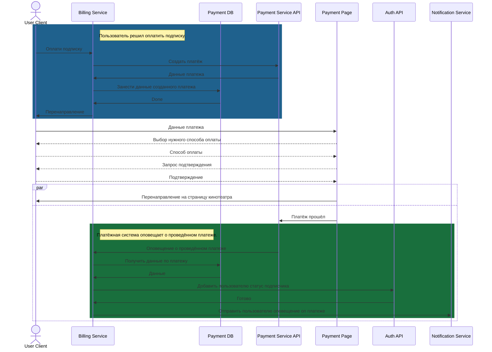
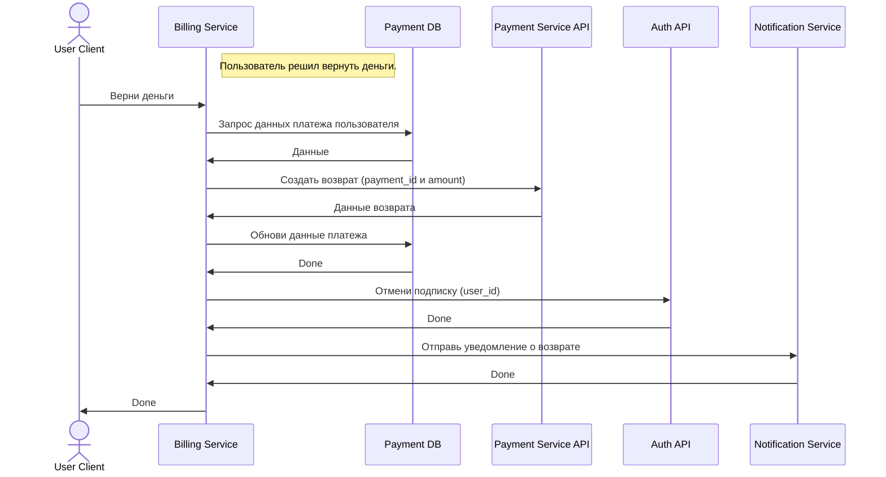
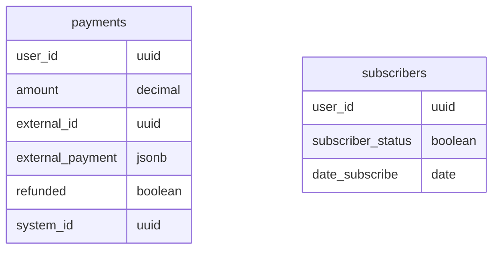

# Биллинг - проектное задание

**Сложность**: высокая

**Команда**: ~4 человека

Выполните проект «Биллинг».
- Нужно сделать два метода работы с картами:
  - оплатить подписку
  - вернуть за неё деньги

- При этом система должна быть устойчивой к перебоям:
  - не должно происходить двойных списаний
  - у пользователя всегда была гарантия, что операция выполнилась

- Помимо реализации системы, интегрируйте эту систему с админкой Django, чтобы:
  - вы могли контролировать оплату подписок клиентами

## Основные сценарии работы с сервисом

### Оплатить подписку

### Вернуть деньги за подписку

### Payments history DB

Схема в БД для данных: `payments_history`

Данные по истории платежей:

